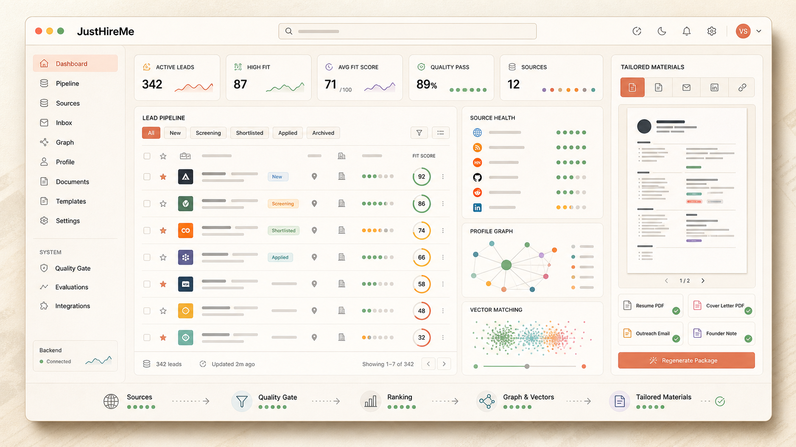
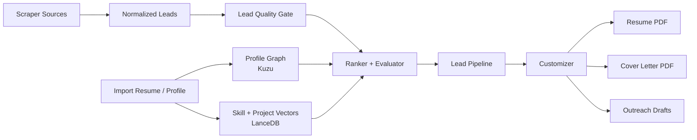
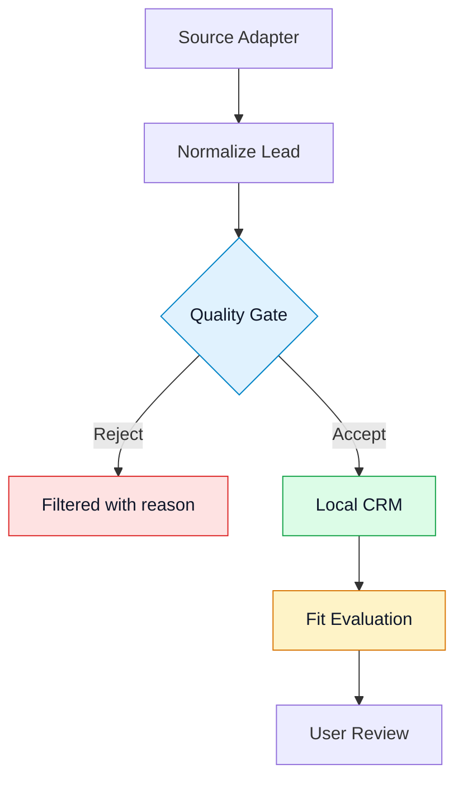
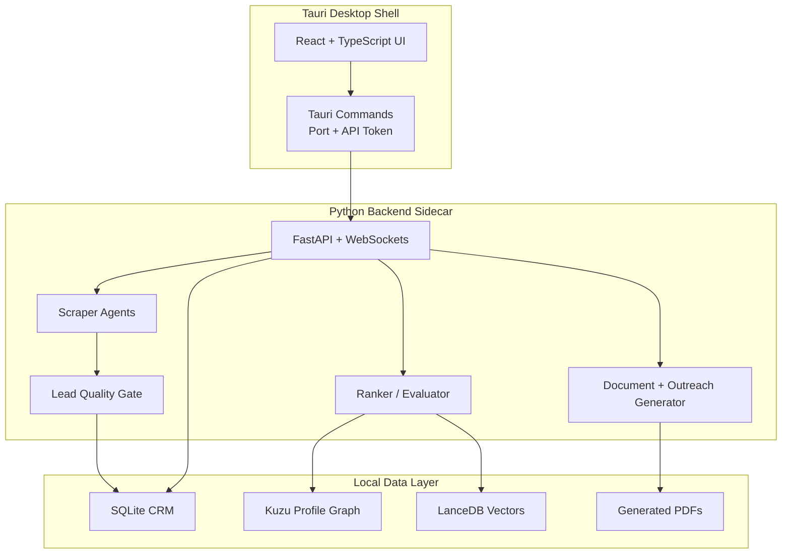
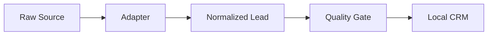
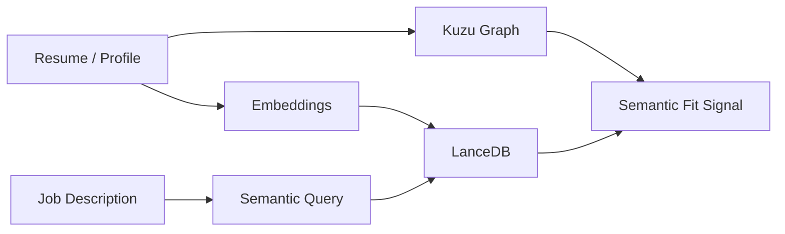
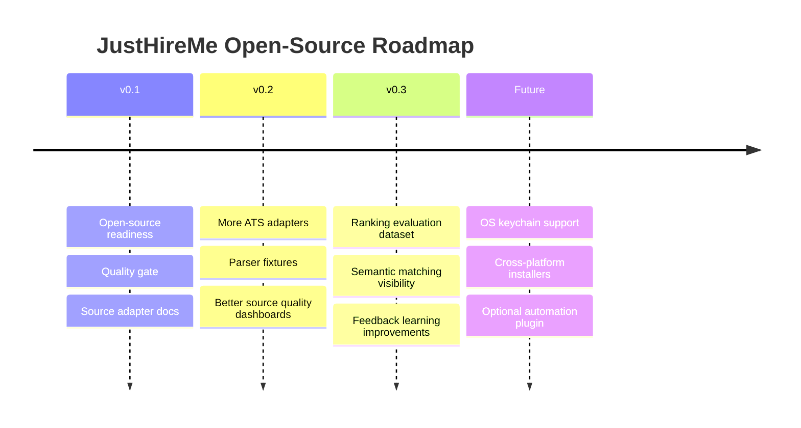

<p align="center">
  
</p>

<h1 align="center">JustHireMe</h1>

<p align="center">
  <strong>Local-first AI job intelligence for scraping better roles, ranking fit, and generating tailored application materials.</strong>
</p>

<p align="center">
  <a href="LICENSE"></a>
  
  
  
  
</p>

<p align="center">
  <a href="#what-it-does">What It Does</a>
  &middot;
  <a href="#visual-workflow">Workflow</a>
  &middot;
  <a href="#architecture">Architecture</a>
  &middot;
  <a href="#quick-start">Quick Start</a>
  &middot;
  <a href="#agent-skill-and-mcp">Agent Skill + MCP</a>
  &middot;
  <a href="#contributing">Contributing</a>
  &middot;
  <a href="#roadmap">Roadmap</a>
</p>

---

## The Short Version

JustHireMe is an AGPL-licensed, local-first desktop workbench for people who are tired of noisy job boards and black-box AI apply tools.

## Maintainer

JustHireMe is built and maintained by Vasudev Siddh - full-stack AI engineer, open-source builder, and the person who got tired of bad job boards and built something better.

**Sponsor the project** - Sponsorship keeps JustHireMe actively maintained, funds source adapter coverage, and supports the local-first architecture that makes this different from every cloud-first alternative.

## Current Status

JustHireMe is in alpha. The repository is public, hackable, and ready for source-adapter, ranking, docs, and Windows packaging contributions, but it is not a polished one-click consumer product yet.

| Area | Status |
| --- | --- |
| Frontend workbench | Active |
| Python sidecar API | Active |
| Scraper, ranking, vector matching, and customizer core | Supported open-source scope |
| Windows desktop packaging | First release target |
| Browser automation / auto-apply | Experimental lab, disabled by default |
| API key storage | Local app settings for now; OS keychain planned |

If you are new here, start with the frontend preview first. If you want to contribute backend behavior, source adapters, or packaging, use the full desktop setup below.

It helps you:

| Stage | What JustHireMe Does | Why It Matters |
| --- | --- | --- |
| Scrape | Collect leads from ATS boards, feeds, communities, APIs, and configured sources | You are not locked into one job board |
| Quality Gate | Reject stale, thin, spammy, senior-only, or low-context leads before they pollute the pipeline | Better signal, less cleanup |
| Rank | Score lead quality and candidate fit with explainable deterministic rules, feedback learning, and optional LLM reasoning | You can see why a role is worth attention |
| Match | Use Kuzu graph data and LanceDB vectors to compare jobs against your profile context | Matching is profile-aware, not keyword-only |
| Customize | Generate tailored resume PDF, cover letter PDF, and outreach drafts | You get a useful package, not just a list of links |

> Browser automation and auto-apply code exists in the repository, but it is experimental and unsupported. The supported open-source core is scraper, ranker, vector matching, and customizer.

---

## Visual Workflow





---

## What It Does

<table>
  <tr>
    <td width="50%">
      <h3>Scrape From Many Sources</h3>
      <p>Collect jobs from ATS/company boards, RSS feeds, Hacker News, GitHub-style sources, Reddit/community sources, APIs, and custom configured targets.</p>
    </td>
    <td width="50%">
      <h3>Reject Low-Quality Leads</h3>
      <p>Apply a deterministic quality gate before saving leads. Filter stale, thin, senior-only, unpaid, spammy, or missing-context postings.</p>
    </td>
  </tr>
  <tr>
    <td width="50%">
      <h3>Rank Fit Transparently</h3>
      <p>Score role alignment, stack coverage, project evidence, seniority fit, location constraints, red flags, source signal, and semantic profile similarity.</p>
    </td>
    <td width="50%">
      <h3>Generate Tailored Packages</h3>
      <p>Create a resume PDF, cover letter PDF, founder message, LinkedIn note, cold email, keyword coverage summary, and selected-project rationale.</p>
    </td>
  </tr>
</table>

---

## Why This Exists

Most job search tools make one of two mistakes:

| Problem | Result |
| --- | --- |
| They scrape too broadly | Users drown in stale, irrelevant, senior-only, or spammy jobs |
| They automate too aggressively | Users lose control and trust |
| They rank opaquely | Nobody knows why a job was recommended |
| They are cloud-first | Sensitive profile/job data leaves the user's machine |
| They are hard to extend | Contributors cannot easily add new sources or improve ranking |

JustHireMe takes a different path:

```text
More signal.
More explanation.
More local control.
More contributor-friendly source adapters.
Less blind automation.
```

---

## Product Principles

| Principle | Meaning |
| --- | --- |
| Local-first | Profile data, lead history, generated docs, graph data, vectors, and settings live locally by default |
| Explainable | Every important ranking and filtering decision should have a visible reason |
| Contributor-friendly | Adding a source adapter should be approachable and testable |
| Human-controlled | Generated materials are drafts for review, not magic submissions |
| Honest fallback | If vectors, models, or source data fail, the app should say so |
| Automation is experimental | Browser automation is a lab area, not the core open-source promise |

---

## Architecture



| Area | Technology |
| --- | --- |
| Desktop shell | Tauri 2 |
| Frontend | React 19, TypeScript, Vite, Tailwind CSS |
| Backend API | Python 3.13, FastAPI, WebSockets |
| Local CRM | SQLite |
| Profile graph | Kuzu |
| Vector store | LanceDB |
| Matching | Deterministic scoring, semantic search, optional LLM evaluation |
| Documents | Markdown/PDF rendering |
| Experimental lab | Playwright browser automation |
| Packaging | Tauri bundle + Python sidecar |

More detail: [docs/ARCHITECTURE.md](docs/ARCHITECTURE.md)

---

## Repository Map

```text
JustHireMe/
|-- src/                         React frontend
|   |-- components/              Shared UI components
|   |-- hooks/                   Data and websocket hooks
|   |-- settings/                Settings panels
|   `-- views/                   Main screens
|-- backend/                     Python API and agents
|   |-- agents/                  Scrapers, rankers, evaluator, generator
|   |-- db/                      SQLite, Kuzu, LanceDB helpers
|   |-- graph/                   Evaluation graph flow
|   `-- tests/                   Backend tests
|-- src-tauri/                   Tauri Rust shell
|-- docs/                        Architecture, source adapter, release docs
|-- scripts/                     Build scripts
`-- .github/                    CI, issue templates, PR template
```

---

## Quick Start

### Install On Windows

Use this path if you are not a developer and just want to run JustHireMe.

1. Open the latest [GitHub Release](https://github.com/vasu-devs/JustHireMe/releases/latest).
2. Download the `JustHireMe_*_x64-setup.exe` installer.
3. Run the installer.
4. If Windows SmartScreen appears, click **More info**, then **Run anyway**.
5. Launch JustHireMe from the Start Menu and follow the setup wizard.

Release notes include SHA256 checksums for the installer assets. The Windows installer is built by GitHub Actions from the release tag so the published binary matches the repository source.

### Requirements

| Tool | Version |
| --- | --- |
| Node.js | 20+ |
| Python | 3.13+ |
| Rust | stable |
| uv | latest stable |
| Git | any modern version |

Optional:

- Ollama for local model experiments
- Playwright browser dependencies only for experimental automation work

### Fast Frontend Preview

Use this path if you just want to inspect the UI, design direction, or frontend code.

```bash
git clone https://github.com/vasu-devs/JustHireMe.git
cd JustHireMe
npm install
npm run dev
```

This starts the Vite frontend only. Backend-backed workflows may show empty, mocked, or unavailable states depending on the screen.

### Full Desktop Setup

Use this path if you want the Tauri shell and Python backend sidecar.

```bash
git clone https://github.com/vasu-devs/JustHireMe.git
cd JustHireMe
npm install
cd backend
uv sync --dev
cd ..
```

Then run:

```bash
npm run tauri dev
```

The Tauri shell starts the frontend and launches the Python backend sidecar/dev process.

### Before Opening An Issue

- Check whether the bug is in supported core behavior or experimental automation.
- Remove API keys, cookies, resumes, local databases, and generated private documents from logs or screenshots.
- For source requests, include a public example URL and expected normalized fields.
- For ranking bugs, include the expected score behavior and sanitized job/profile snippets.

---

## Development Commands

| Task | Command |
| --- | --- |
| Frontend dev server | `npm run dev` |
| Desktop dev app | `npm run tauri dev` |
| TypeScript check | `npm run typecheck` |
| Frontend tests | `npm test` |
| Frontend build | `npm run build` |
| Backend tests on Windows | `backend/.venv/Scripts/python.exe -m pytest backend/tests` |
| Backend tests on macOS/Linux | `backend/.venv/bin/python -m pytest backend/tests` |
| MCP server on Windows | `backend/.venv/Scripts/python.exe backend/mcp_server.py` |
| MCP server on macOS/Linux | `backend/.venv/bin/python backend/mcp_server.py` |
| Rust check | `cd src-tauri && cargo check` |

---

## Agent Skill And MCP

JustHireMe includes two reusable agent surfaces:

- An agent-neutral skill at `skills/justhireme/SKILL.md`
- A lightweight stdio MCP server at `backend/mcp_server.py`

The skill is plain Markdown with YAML frontmatter. It is written to be useful in any AI coding assistant that can load local instructions, including Claude, Codex, IDE agents, and custom agent runners. It tells an agent how to work safely inside this repository: preserve local-first behavior, keep ranking explainable, treat browser automation as experimental, and use the existing backend/frontend patterns.

### Use The Skill

Point your agent or assistant at:

```text
skills/justhireme/SKILL.md
```

If your agent expects skills in a separate directory, copy or symlink the `skills/justhireme` folder into that tool's skill/instruction location. The skill has no runtime dependency on Codex-specific APIs.

### Use The MCP Server

Install backend dependencies first:

```bash
cd backend
uv sync --dev
cd ..
```

Start the MCP server from the repository root on Windows:

```powershell
backend\.venv\Scripts\python.exe backend\mcp_server.py
```

Start it on macOS/Linux:

```bash
backend/.venv/bin/python backend/mcp_server.py
```

The MCP server exposes:

| Tool | Purpose |
| --- | --- |
| `score_job_fit` | Score a raw job posting against a candidate JSON profile |
| `evaluate_lead_quality` | Run the deterministic quality gate for a normalized lead |
| `extract_lead_intel` | Extract company, location, budget, urgency, stack, and signal quality from lead text |

Example MCP client configuration:

```json
{
  "mcpServers": {
    "justhireme": {
      "command": "/absolute/path/to/JustHireMe/backend/.venv/bin/python",
      "args": ["/absolute/path/to/JustHireMe/backend/mcp_server.py"],
      "cwd": "/absolute/path/to/JustHireMe"
    }
  }
}
```

On Windows, use the venv interpreter at `backend\\.venv\\Scripts\\python.exe`. More detail: [docs/MCP.md](docs/MCP.md)

---

## Core Concepts

### Source Adapters

Source adapters turn external job sources into normalized lead dictionaries.



Read: [docs/source-adapters.md](docs/source-adapters.md)

### Quality Gate

The gate lives in `backend/agents/quality_gate.py`.

It checks:

| Signal | Example |
| --- | --- |
| URL exists | Reject rows with no source/apply URL |
| Posting depth | Penalize thin scraped snippets |
| Freshness | Penalize stale jobs |
| Seniority | Reject senior-only roles in beginner-focused feeds |
| Red flags | Penalize unpaid, commission-only, no-budget, homework, or exposure posts |
| Company/context | Penalize missing company or unclear source context |

### Ranking

Ranking combines:

- source signal
- lead quality score
- deterministic fit rubric
- seniority caps
- project and stack evidence
- optional LLM-assisted evaluation
- semantic fit when vectors are available
- feedback learning

### Vector Matching



### Customizer

For a strong lead, the customizer produces:

| Output | Purpose |
| --- | --- |
| Tailored resume PDF | Role-specific resume package |
| Cover letter PDF | Focused application narrative |
| Founder message | Short direct outreach |
| LinkedIn note | Concise connection/message draft |
| Cold email | Longer outreach draft |
| Keyword coverage | Shows what the generated package covers |
| Selected projects | Explains which profile evidence was used |

---

## Configuration And Privacy

Settings are configured inside the desktop app. For v1, API keys are stored in local app settings.

Local data may include:

| Data | Stored Locally |
| --- | --- |
| Profile graph | yes |
| Vector tables | yes |
| Lead CRM | yes |
| Generated PDFs | yes |
| Settings | yes |
| Activity history | yes |

Do not share screenshots, logs, local app data, issue attachments, or database files that contain API keys, cookies, private resumes, or personal data.

Planned improvement:

- OS keychain-backed API key storage

---

## Windows Release Build

The first public packaging target is Windows. Public installers are built and published by GitHub Actions when a `v*` tag is pushed.

```powershell
npm run release
```

For local smoke tests without installer bundling, use `npm run release:fast`.

Release smoke test and packaging details: [docs/windows-release.md](docs/windows-release.md)

---

## Contributing

The best first contribution path is scraper/source quality.

<table>
  <tr>
    <td width="33%">
      <h3>Good First Issues</h3>
      <p>Add parser fixtures, improve docs, polish UI copy, or add a small source rule.</p>
    </td>
    <td width="33%">
      <h3>Source Contributors</h3>
      <p>Add ATS/company-board adapters with normalized lead fields and quality-gate tests.</p>
    </td>
    <td width="33%">
      <h3>Ranking Contributors</h3>
      <p>Improve score bands, seniority handling, semantic fallback, and feedback learning.</p>
    </td>
  </tr>
</table>

Start here:

| Document | Purpose |
| --- | --- |
| [CONTRIBUTING.md](CONTRIBUTING.md) | Contribution rules and development workflow |
| [CODE_OF_CONDUCT.md](CODE_OF_CONDUCT.md) | Community standards |
| [docs/ARCHITECTURE.md](docs/ARCHITECTURE.md) | System design |
| [docs/source-adapters.md](docs/source-adapters.md) | Scraper adapter contract |
| [docs/MAINTAINER_RELEASE_CHECKLIST.md](docs/MAINTAINER_RELEASE_CHECKLIST.md) | Release and safety checklist |
| [ROADMAP.md](ROADMAP.md) | Project direction |
| [SECURITY.md](SECURITY.md) | Privacy and responsible reporting |

Please do not open public issues with API keys, resumes, cookies, bearer tokens, or database files.

---

## Experimental Automation

The repository contains browser automation and auto-apply code for experimentation and future plugin work.

| Status | Meaning |
| --- | --- |
| Disabled by default | Not part of the supported job workflow |
| Unsupported lab | Useful for contributors, not normal users |
| Not marketed as core | The product works without it |
| Potential future plugin | May be separated later |

---

## Roadmap



Near-term priorities:

- more high-quality ATS/company source adapters
- stronger quality gate tests
- clearer vector matching state in the UI
- Windows installer polish
- contributor-friendly source plugin boundaries
- OS keychain support for API keys

---

## License

JustHireMe is open source under the [GNU Affero General Public License v3.0 only](LICENSE).

You may self-host, modify, and use JustHireMe, including with your own API
keys, under the terms of the AGPL-3.0 license. If you modify JustHireMe and
make it available over a network, the AGPL requires you to provide the
corresponding source code for that modified version to users of the network
service.

Commercial licenses are available for organizations that want to use
JustHireMe outside the AGPL terms, including private forks, proprietary
modifications, embedding, white-labeling, or managed deployments. See
[COMMERCIAL_LICENSE.md](COMMERCIAL_LICENSE.md) for the commercial path.

---

## Maintainer Note

This project is being built in the open because one person cannot cover every job source, every market, every ranking edge case, and every packaging path alone.

The goal is a useful local tool and a welcoming codebase where contributors can add sources, improve ranking, and help job seekers get better signal with less noise.
